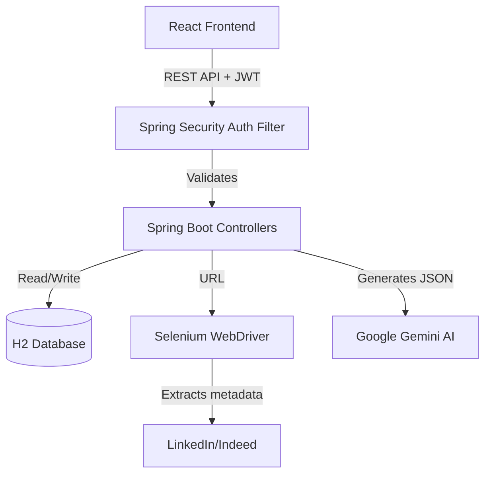

# 🚀 Automated Job Application Tracker


A full-stack, AI-powered application designed to streamline the job hunt process. Built with React, Spring Boot, and Google's Gemini AI, this platform goes beyond a standard Kanban board by automating data entry and generating tailored interview prep material.

## ✨ Key Features

1. **📊 Analytics Dashboard**
   - Real-time visualization of your application funnel.
   - Calculates Interview Rate, Offer Rate, and provides a status breakdown via a custom animated donut chart.

2. **🧠 AI Interview Coach (Gemini Integration)**
   - Paste a job description and the Gemini 2.0 Flash model instantly generates tailored Technical Questions, Behavioral Questions, Company-Specific Tips, and estimated Salary Ranges.

3. **🤖 Magic Scraper**
   - Headless Selenium WebDriver integration automatically extracts the Job Title and Company Name from LinkedIn or Indeed URLs, eliminating manual data entry.

4. **🔐 JWT Authentication & Security**
   - Secure stateless authentication using Spring Security and JSON Web Tokens.
   - User-scoped data (your applications are private to your account).
   - BCrypt password hashing.

5. **📱 Premium UI/UX**
   - Custom-built, glassmorphic dark mode design system.
   - Drag-and-drop Kanban board for seamless status updates.
   - Micro-animations and responsive layout.

---

## 🏗️ Architecture



## 💻 Tech Stack

**Frontend:**
- React 18 (Vite)
- `@hello-pangea/dnd` (Drag and Drop)
- Vanilla CSS (Custom Design System, CSS Variables, Animations)

**Backend:**
- Java 17 + Spring Boot 3.2.4
- Spring Data JPA + H2 In-Memory Database
- Spring Security + JJWT (JSON Web Token)
- Selenium WebDriver (Web Scraping)
- Google Gemini API (Generative AI)

---

## 🚀 How to Run Locally

### Prerequisites
- JDK 17+
- Node.js 18+
- Maven
- [Google AI Studio API Key](https://aistudio.google.com/apikey) (Free)

### 1. Setup Backend
```bash
cd job-tracker-backend
```
Open `src/main/resources/application.properties` and add your Gemini API Key:
```properties
gemini.api.key=YOUR_API_KEY_HERE
```
Run the Spring Boot application:
```bash
mvn spring-boot:run
```
*(The backend runs on `http://localhost:8080`)*

### 2. Setup Frontend
```bash
cd job-tracker-frontend
npm install
npm run dev
```
*(The frontend runs on `http://localhost:5173`)*

---

## 📝 Resume Bullet Points
If you are adding this project to your resume, here are some suggested bullet points:

> - **Developed an AI-powered Full-Stack Job Tracking Platform** using React and Spring Boot to manage the application lifecycle and generate tailored interview prep questions via the Google Gemini API.
> - **Engineered an automated web-scraping microservice** using Selenium WebDriver to extract job metadata from target URLs, significantly reducing manual user data entry.
> - **Implemented stateless JWT authentication** with Spring Security and BCrypt password hashing to ensure secure, user-scoped data access.
> - **Designed a custom responsive UI design system** featuring drag-and-drop Kanban boards and an integrated analytics dashboard for tracking interview conversion rates.
